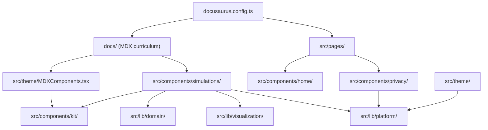

# Control Lab Architecture

This document explains how the repository is divided, how data flows through the
site, and where a new contribution belongs. The goal is to keep lessons easy to
extend without coupling mathematical models to Docusaurus, browser storage, or a
particular visualization.

## System Shape



The arrows show allowed dependencies. Content and page entry points compose
components. Components may use shared libraries. Libraries must not import
lessons, pages, or theme overrides.

## Repository Map

### Root

| Path | Responsibility |
| --- | --- |
| `AGENTS.md` | Canonical, tool-neutral repository instructions for AI-assisted work. |
| `AI_WORKFLOW.md` | Reusable prompts and human verification stages for AI-assisted contributions. |
| `GOVERNANCE.md` | Maintainer authority, proposal decisions, and merge policy. |
| `.github/` | CI, deployment, dependency updates, ownership, and contributor templates. |
| `docs/` | The curriculum. Every lesson is an MDX document organized by module. |
| `scripts/` | Repository checks run locally and in GitHub Actions. |
| `src/` | React components, reusable logic, pages, styles, and Docusaurus integration. |
| `static/` | Files copied directly into the production site, such as diagrams and icons. |
| `templates/` | Copyable source templates that are not built as curriculum pages. |
| `docusaurus.config.ts` | Site URL, plugins, math rendering, navigation, privacy policy, PWA, and theme configuration. |
| `sidebars.ts` | Filesystem-generated curriculum navigation. |
| `package.json` | Runtime dependencies and the supported development commands. |
| `tsconfig.json` | Strict TypeScript and editor configuration. |

Generated directories such as `build/`, `.docusaurus/`, and `node_modules/` are
not source code and must not be committed.

### `docs/`: Curriculum Source

Each first-level folder represents a curriculum module. A module normally
contains:

```text
docs/<module>/
  _category_.json   sidebar label and module order
  index.mdx         module overview
  <lesson>.mdx      one lesson
```

Lesson order comes from `sidebar_position` in frontmatter. Links between lessons
use relative `.mdx` paths so Docusaurus can detect broken links during the build.
Lesson-specific simulations are imported directly from their domain folder:

```mdx
import Kalman from '@site/src/components/simulations/signal-processing/Kalman';
```

Shared MDX primitives such as `<Abstract>`, `<EquationLegend>`, and `<JavaCode>`
do not need local imports. They are registered once in
`src/theme/MDXComponents.tsx`.

### `src/components/`: React Presentation

| Directory | Responsibility |
| --- | --- |
| `home/` | Components used only by the home page. |
| `kit/` | Reusable teaching and demo primitives shared across subject areas. |
| `privacy/` | Consent UI and privacy controls. |
| `simulations/` | Interactive teaching models grouped by curriculum domain. |

Components own rendering and interaction. Reusable equations and algorithms
belong in `src/lib/domain`, not inside a large component. Browser persistence,
analytics, and URL safety belong in `src/lib/platform`.

#### Simulation Domains

| Directory | Typical contents |
| --- | --- |
| `foundations/` | Introductory feedback and mathematical intuition. |
| `software-architecture/` | State machines, command scheduling, and loop timing. |
| `control-theory/` | Motor models, PID, feedforward, identification, saturation, and profiles. |
| `signal-processing/` | Filters, Kalman estimation, EKF linearization, and sensor uncertainty. |
| `localization/` | Odometry, twists, and pose exponentials. |
| `path-following/` | Kinematics, pursuit, splines, vector fields, and steering geometry. |
| `state-space/` | State feedback and optimal-control explorers. |
| `research/` | Projectile simulation and shoot-on-the-move case studies. |

A simulation is assigned by the concept it teaches, not by every page that
happens to reuse it. For example, `BangBang` remains in `control-theory` even
when an advanced-topic lesson embeds it.

### `src/lib/`: Reusable Logic

`src/lib` is split by runtime responsibility:

| Directory | Contract |
| --- | --- |
| `domain/` | Framework-independent mathematics and physical models. No React, DOM, storage, analytics, or Docusaurus imports. |
| `visualization/` | Canvas sizing, animation hooks, traces, and plotting infrastructure. |
| `platform/` | Browser and site integration: consent, analytics, progress storage, and safe video URLs. |

Tests are colocated with the code they verify. A change to a mathematical model
should normally add or update a test in `domain/`. Platform parsing and privacy
behavior are tested in `platform/`.

### Docusaurus Integration

| Path | Responsibility |
| --- | --- |
| `src/theme/MDXComponents.tsx` | Registers the small global vocabulary available in every MDX lesson. |
| `src/theme/Root.tsx` | Wraps the whole application with consent handling. |
| `src/theme/DocItem/Footer/` | Adds lesson progress controls to the standard document footer. |
| `src/theme/DocSidebarItem/` | Reflects completion state in the standard sidebar. |
| `src/clientModules/fitMath.ts` | Fits wide KaTeX display equations after route changes and resizes. |
| `src/css/custom.css` | Design tokens, typography, accessibility rules, and Docusaurus overrides. |

Theme overrides should stay small. Prefer composing the original Docusaurus
component instead of copying an entire upstream implementation.

### Pages and Assets

`src/pages/index.tsx` is the home page. Other files in `src/pages/` become
standalone routes, such as `/privacy` and `/contributors`.

Files in `static/` keep their relative URL in the built site. Put diagrams used
by lessons under `static/img/` and reference them with the configured base URL
or Docusaurus helpers. Do not place source TypeScript in `static/`.

### Repository Checks

| Command | What it protects |
| --- | --- |
| `npm run check:architecture` | Directory boundaries and import direction. |
| `npm run check:content` | Lesson metadata, public-language rules, placeholders, and unsafe embeds. |
| `npm run check:contributor` | AI guidance, governance, ownership, and contribution-template integrity. |
| `npm run typecheck` | TypeScript contracts. |
| `npm test` | Mathematical and platform behavior. |
| `npm run build` | SSR, MDX compilation, links, KaTeX, and production bundling. |
| `npm run security` | Workflow, lockfile, and built-output security assumptions. |
| `npm run size` | Production artifact budget. |

CI and deployment run the same sequence, so a local pass should match the pull
request result.

## Dependency Rules

1. `docs/` and `src/pages/` are composition layers. They may import components,
   but reusable components must not import lessons or pages.
2. `src/components/simulations/<domain>/` may import `kit`, `lib/domain`,
   `lib/visualization`, and narrowly scoped `lib/platform` services.
3. `src/components/kit/` must remain subject-neutral. A component that teaches
   one algorithm belongs in `simulations/`, not `kit/`.
4. `src/lib/domain/` must be deterministic and runnable without a browser.
5. `src/lib/visualization/` may depend on React and other visualization helpers,
   but not on lessons or platform storage.
6. `src/lib/platform/` owns browser-side effects. Consent must be checked before
   analytics code is loaded.
7. Import concrete simulation files. Do not create a single barrel that exports
   every simulation; direct imports preserve clear ownership and smaller page
   chunks.

These rules are enforced where practical by `scripts/architecture-check.mjs`.

## Common Extension Paths

### Add a Lesson

1. Choose the existing module under `docs/`.
2. Create `<lesson>.mdx` with frontmatter, tags, and a two-sentence abstract.
3. Follow the lesson sequence in `CONTRIBUTING.md`.
4. Use relative `.mdx` links to connect prerequisites and follow-up lessons.
5. Run `npm run check:content` and `npm run build`.

### Add an Interactive Simulation

1. Choose the domain under `src/components/simulations/`.
2. Create a deeply typed `.tsx` component with one explicit teaching objective.
3. Reuse controls from `src/components/kit/`.
4. Move reusable equations into `src/lib/domain/` and test them there.
5. Keep canvas, timers, and browser APIs inside effects or event handlers, with
   cleanup.
6. Import the component directly from the lesson that uses it.

### Add Mathematical or Physical Logic

1. Add a named module under `src/lib/domain/`.
2. Use explicit units in names or types where ambiguity would be dangerous.
3. Keep functions deterministic and independent of rendering.
4. Add boundary, nominal, and failure-case tests next to the module.
5. Let one or more simulations consume the model rather than duplicating it.

### Add a Shared Lesson Primitive

1. Add the component to `src/components/kit/`.
2. Keep the API independent of a particular lesson.
3. Register it in `src/theme/MDXComponents.tsx` only if it will be used broadly
   in MDX.
4. Document it in `src/components/kit/README.md`.

### Add a Browser Integration

1. Put the browser-facing service in `src/lib/platform/`.
2. Put its UI, if any, in a focused component directory.
3. Guard server-side rendering and unavailable browser APIs.
4. Add tests for parsing, defaults, and denied-consent behavior.
5. Document any new data flow in the privacy page and security policy.

## Review Heuristics

A pull request is easier to review when:

- lesson prose, model logic, and rendering changes are separated when practical;
- equations are tested outside the canvas component;
- exact hardware claims have primary sources;
- each new directory has one clear responsibility;
- imports point inward toward shared code, never back toward pages;
- generated files and local assistant state are excluded;
- the pull request states what was verified manually and automatically.

For content and code standards beyond the architecture itself, see
`CONTRIBUTING.md`.
